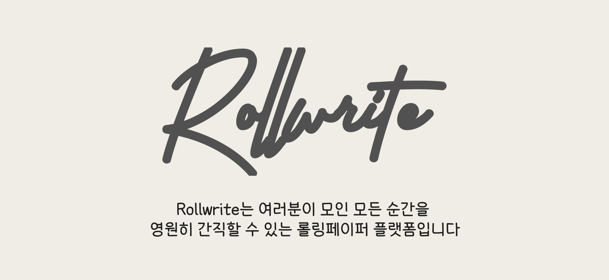

- [Project](#project)
- [About](#about)
- [Developers](#developers)
- [Tech Stack](#tech-stack)
- [서비스 소개](#서비스-소개)
- [기능 상세](#기능-상세)
  - [1. 소셜 로그인](#1-소셜-로그인)
  - [2. 모임 생성](#2-모임-생성)
  - [3. 모임 참여 / 친구 초대](#3-모임-참여--친구-초대)
  - [4. 모임 알림](#4-모임-알림)
  - [5. 모임 상세보기](#5-모임-상세보기)
  - [6. 답변 하기](#6-답변-하기)
  - [7. 랜덤 질문 뽑기](#7-랜덤-질문-뽑기)
  - [8. 직접 질문 작성](#8-직접-질문-작성)
  - [9. 모임 어워드 확인 / 모임 결과 확인](#9--모임-어워드-확인--모임-결과-확인)
  - [10. 모임 확인(진행 중 / 완료)](#10-모임-확인진행-중--완료)
  - [11. 프로필 편집](#11-프로필-편집)
  - [12. 공지사항 / 의견 보내기](#12-공지사항--의견-보내기)
  - [13. 관리자 페이지](#13-관리자-페이지)
- [Version](#version)
- [ER 다이어그램](#er-다이어그램)
- [API 명세서](#api-명세서)
- [와이어프레임](#와이어프레임)
- [배포 아키텍처](#배포-아키텍처)
- [포팅 매뉴얼](#포팅-매뉴얼)

## Project

> `SSAFY 8th 자율 프로젝트`  
> 팀 명: **GABOJAGO (가보자고)**  
> 서비스 명: **Rollwrite**  
> 프로젝트 기간: **2023년 4월 10일 ~ 5월 19일 (6주)**

## About

> 여러분, 추억을 간직하는 것은 마음속에 깊이 새겨진 감동과 소중한 순간들을 되살리는 특별한 행위입니다. 이제 `Rollwrite`를 통해 그 행복한 순간들을 끝없는 추억으로 만들어보세요!
>
> `Rollwrite`는 여러분이 모인 모든 순간을 영원히 간직할 수 있는 롤링페이퍼 작성 플랫폼입니다.
>
> 함께 웃고, 함께 울며, 함께 성장한 그 시간들을 마음 속에 영원히 남겨두세요.
> 그 소중한 추억들은 시간이 지나도 변하지 않는 소중한 보물이 될 것입니다.
>
> **함께한 시간을 영원히 간직하다 `Rollwrite`** >  

## Developers

- 공예찬 - 팀장 / FrontEnd
- 주대선 - FrontEnd
- 권태윤 - BackEnd
- 장예주 - BackEnd
- 정세권 - BackEnd
   

## Tech Stack

**FE**

**BE**

 

**DevOps**

 

**협업**

 

## 서비스 소개

- 아침 8시마다 모임 별 새로운 질문 생성
- 모임 생성 시 Chat GPT를 활용한 모임 관련 질문 생성
- 모임 별 사용자가 원하는 질문 추가 가능
- QR코드, URL 링크, 카카오톡을 활용한 친구 초대 기능
- 마지막 날 답변 작성 후 지금까지의 모임 답변 기록 및 통계 확인
- 랜덤으로 상대방이 작성한 답변 확인 가능
   

## 기능 상세

### 1. 소셜 로그인

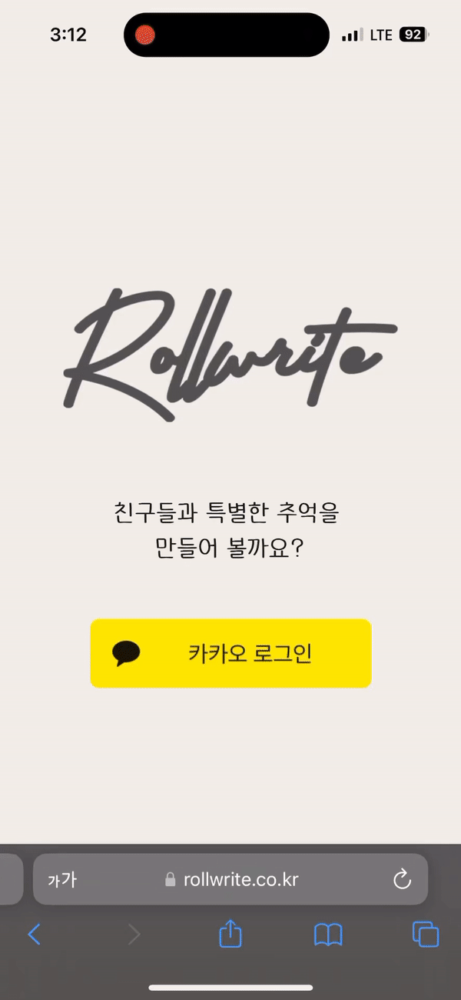

    카카오 로그인을 통해 쉽게 회원가입 가능하다.

### 2. 모임 생성

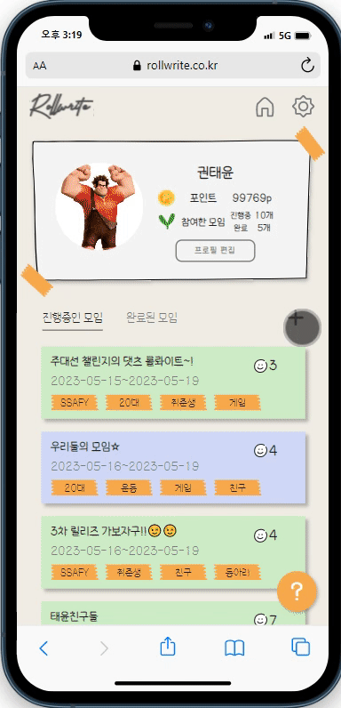

    모임 이름 / 모임 시작일 / 모임 종료일 / 모임 테마 / 모임 태그를 선택하면 해당하는 모임 생성이 가능하다.
    사용자가 직접 입력한 질문이 없는 경우 기본적으로 ChatGPT를 통해 생성된 모임과 관련된 질문이 제공된다.

### 3. 모임 참여 / 친구 초대

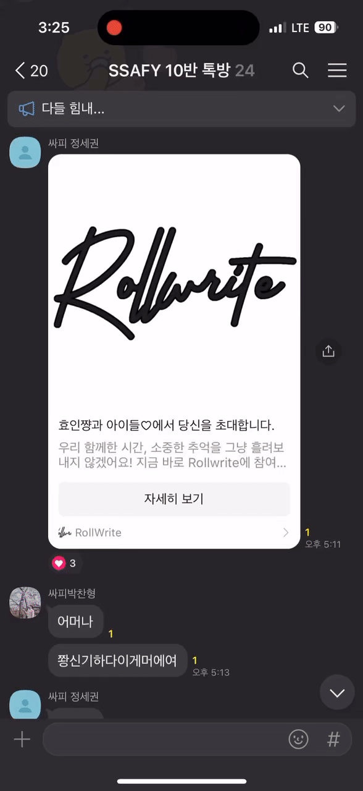
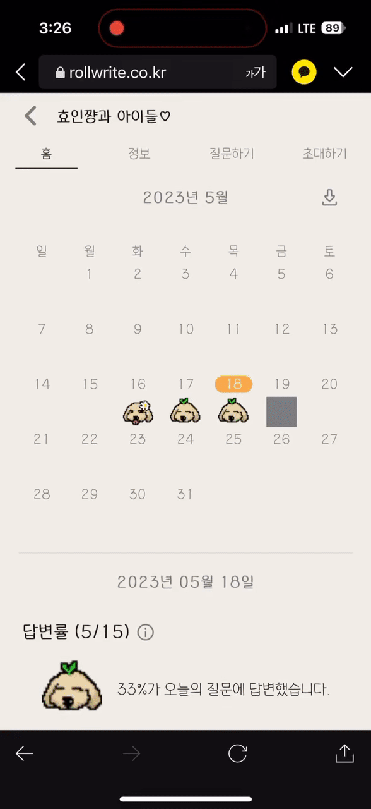

    카카오톡 에서 공유 받은 링크를 통해 접속하거나 직접 링크 접속, QR코드 등을 통해 해당 모임에 참여 가능하다.

### 4. 모임 알림

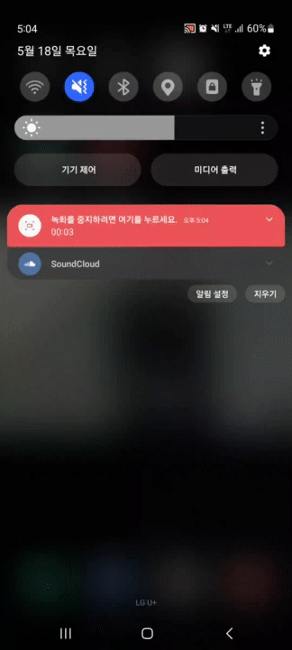

    아침 8시에 새로운 질문이 생성되었다는 알림이 모임 사용자에게 전송된다.

### 5. 모임 상세보기

    모임의 진행 상황을 캘린더를 통해 쉽게 확인 가능하다. 또한, 이미지를 통해 날짜 별 답변률을 확인 가능하다.
    또한, 사용자에게 4가지의 다양한 모임 테마를 제공한다.
    답변 요청하기를 통해 다른 모임원들에게 답변을 재촉하는 카카오톡을 보낼 수 있다.

### 6. 답변 하기

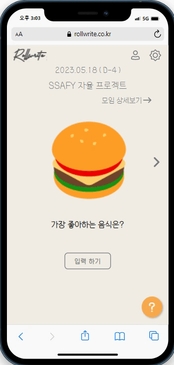
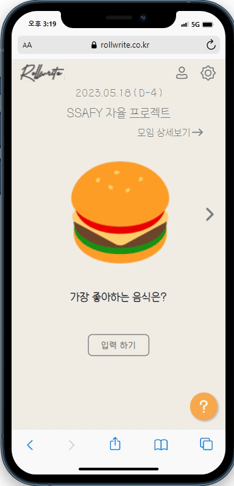

    매일 오전 8시에 올라오는 새로운 질문에 대해 답변을 달 수 있다.
    답변 기한은 다음날 오전 8시 전까지다.

### 7. 랜덤 질문 뽑기

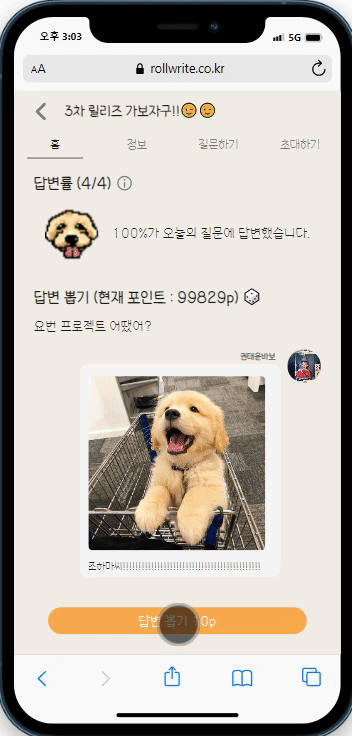

    답변을 작성한 날에는 다른 사용자의 답변을 랜덤으로 확인 가능하다.

### 8. 직접 질문 작성

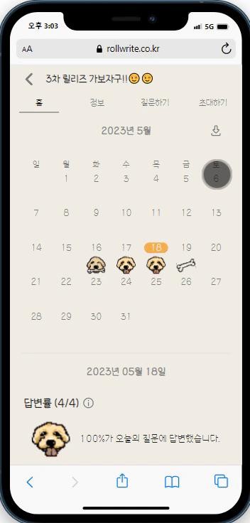

    모임 사용자가 직접 해당 모임에 원하는 질문을 제시할 수 있다.

### 9. 모임 어워드 확인 / 모임 결과 확인

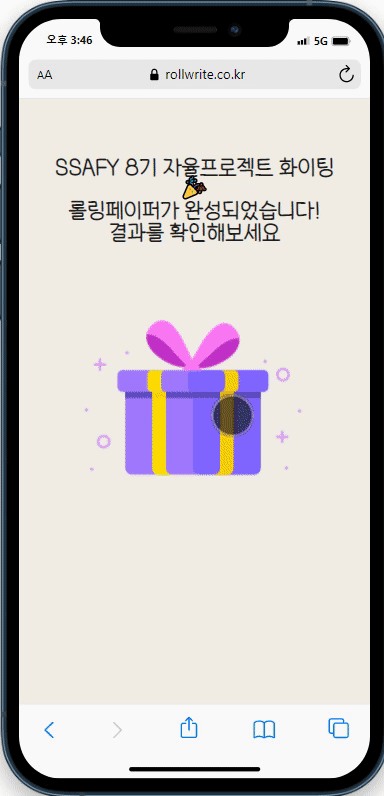
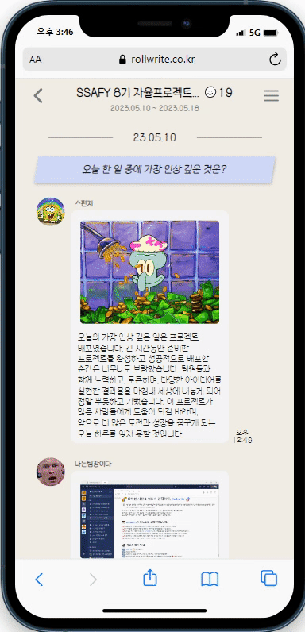

    마지막 질문에 대한 대답을 작성한 후 지금까지 모임 사용자들이 작성한 답변을 토대로 이야기보따리 / 포토그래퍼 / 프로개근러 를 선정한다.
    이후 지금까지 작성한 모임 사용자들의 답변을 확인할 수 있다.

### 10. 모임 확인(진행 중 / 완료)

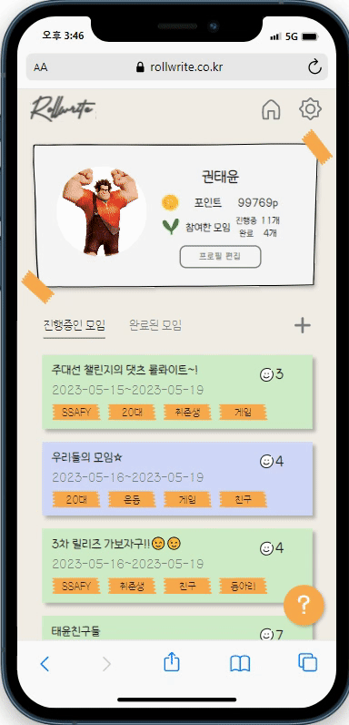

    마이페이지에서 현재 진행 중인 모임과 완료 된 모임을 확인 할 수 있다.

### 11. 프로필 편집

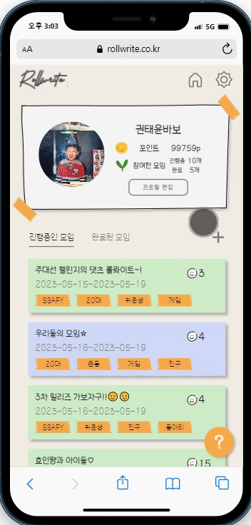

    사용자의 프로필 사진과 닉네임을 변경 가능하다.

### 12. 공지사항 / 의견 보내기

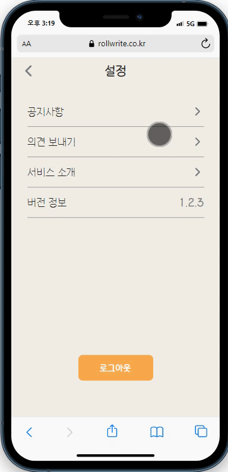

    업데이트와 같은 이벤트가 발생했을때 공지사항을 통해 안내한다.
    사용자의 불편한 점 및 UI / UX 개선을 위한 사용자와의 소통 창구로 사용된다.

### 13. 관리자 페이지

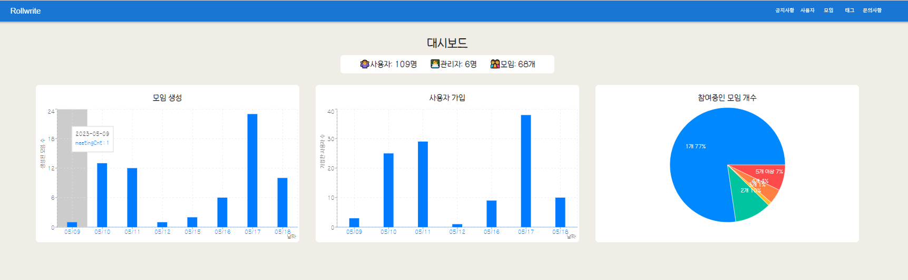  
    
  
    공지사항 / 참여자 / 모임 / 태그 문의사항을 관리 할 수 있다.
    또한, 참여자 별로 참여중인 모임 개수 / 최근 가입자 수 / 최근 생성된 모임 수를 알 수 있다.
 

## Version

v 1.1.1 (23.05.08)

- Rollwrite 서비스 시작

v 1.1.2 (23.05.12)

- 공지사항, 의견 보내기 기능 추가
- 관리자 페이지 추가
- 인앱 브라우저 이슈 해결

v 1.2.1 (23.05.16)

- 페이지 구조 및 디자인 개편
- 포인트 기능 추가
- 답변 보기 기능 추가
- 관리자 페이지 대시보드 추가

v 1.2.2 (23.05.17)

- 기능 및 버그 수정

v 1.2.3 (23.05.18)

- 서비스 소개 페이지 추가

 

## ER 다이어그램

ER 다이어그램

<!-- summary 아래 한칸 공백 두어야함 -->
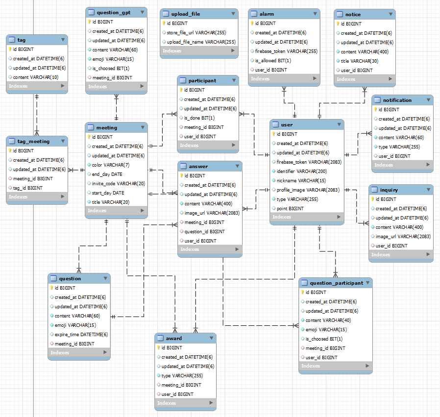  
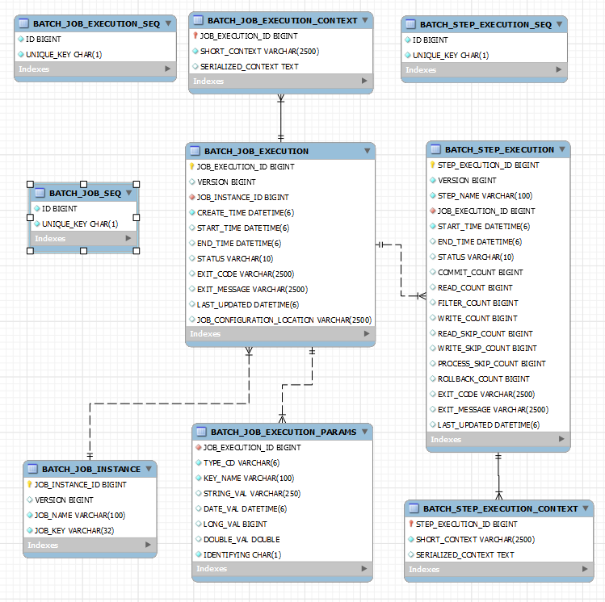  

 

## API 명세서

API 명세서

<!-- summary 아래 한칸 공백 두어야함 -->

[API명세서](./README_assets/02_API.pdf)

 

## 와이어프레임

와이어프레임 초기 기획컨셉

<!-- summary 아래 한칸 공백 두어야함 -->

와이어프레임 v1.1.X

<!-- summary 아래 한칸 공백 두어야함 -->

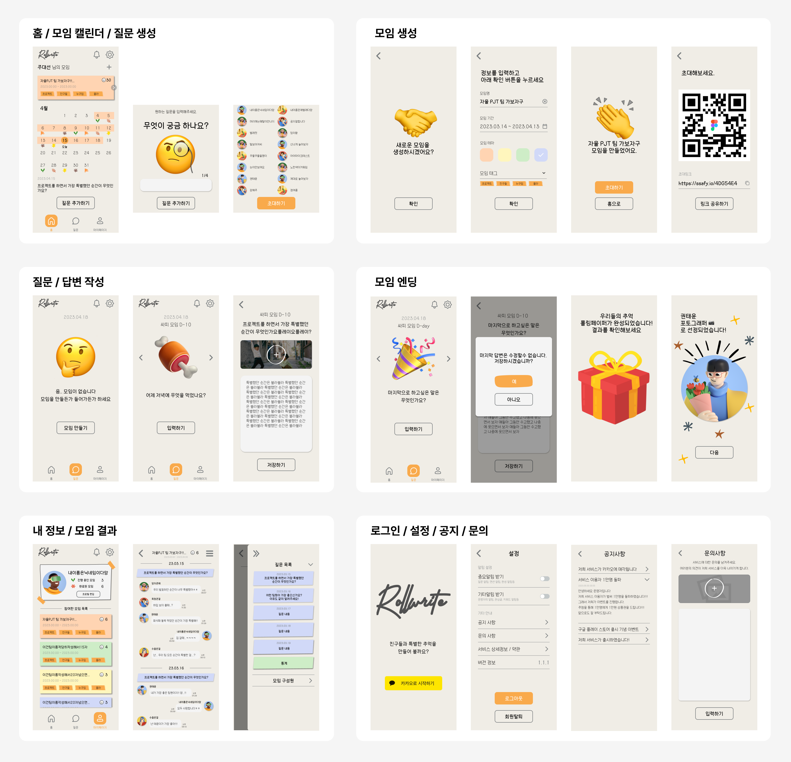

와이어프레임 v1.2.X

<!-- summary 아래 한칸 공백 두어야함 -->

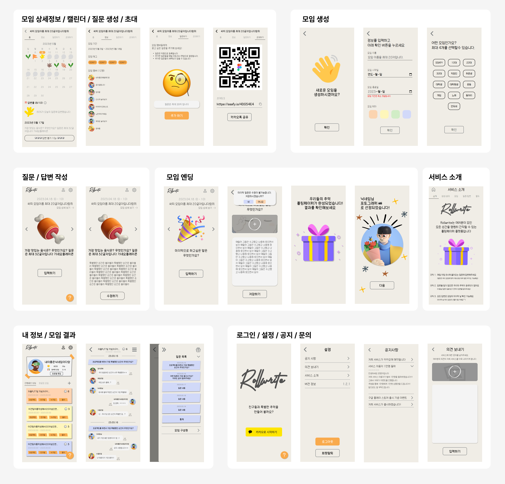

 

## 배포 아키텍처

배포 아키텍처

<!-- summary 아래 한칸 공백 두어야함 -->
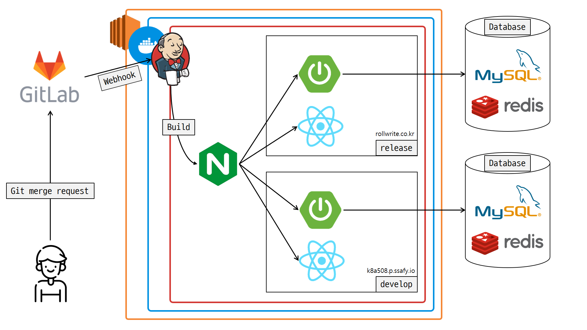  

 

## 포팅 매뉴얼

포팅 매뉴얼

<!-- summary 아래 한칸 공백 두어야함 -->

